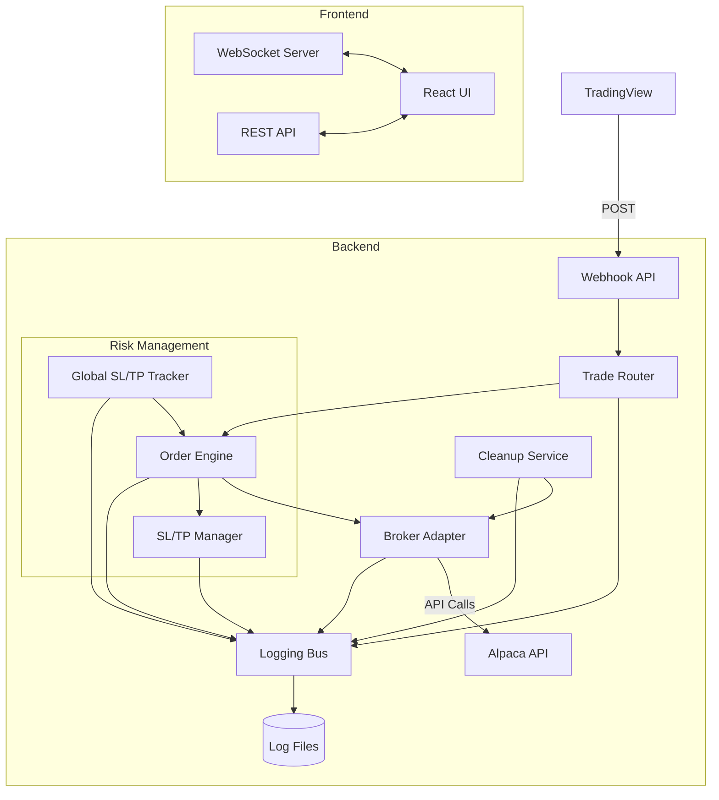

# System Architecture Overview
> Last updated: 2024-05-08

## High-Level Architecture

## Core Components

### 1. Webhook Receiver
- **Responsibility**: Accept and validate incoming TradingView alerts
- **Implementation**: Flask Blueprint at `/webhook` endpoint
- **Key Features**:
  - JSON Schema validation
  - HMAC verification (future)
  - Request logging

### 2. Trade Router
- **Responsibility**: Classify and normalize alert data
- **Implementation**: Python module with clear interfaces
- **Key Features**:
  - Asset class detection (crypto/equity/forex)
  - Trade type classification (long entry/exit, short entry/exit)
  - Broker restriction enforcement

### 3. Order Engine
- **Responsibility**: Determine order parameters and execute via broker
- **Implementation**: Python service with adapter pattern
- **Key Features**:
  - Order sizing calculations
  - Order type selection (market/limit)
  - SL/TP attachment

### 4. Risk Management
- **Responsibility**: Implement safety measures
- **Implementation**: Separate services for per-order and global rules
- **Key Features**:
  - Per-order SL/TP placement
  - Global equity tracking
  - Cleanup of orphaned orders

### 5. Frontend
- **Responsibility**: Provide user interface for configuration and monitoring
- **Implementation**: React application with TypeScript
- **Key Features**:
  - Configuration management
  - Log viewing
  - Status monitoring

## Data Flow

1. **Webhook Reception**:
   - TradingView sends an alert to the webhook endpoint
   - System validates the payload against JSON schema
   - Alert is logged and passed to the Trade Router

2. **Trade Processing**:
   - Trade Router classifies the alert (asset type, trade type)
   - Order Engine determines order parameters based on configuration
   - Broker restrictions are applied (e.g., no crypto shorts on Alpaca)
   - Order is submitted to the broker via adapter

3. **Risk Management**:
   - For entries, SL/TP orders are placed based on configuration
   - Global SL/TP tracker monitors overall equity periodically
   - Cleanup service removes orphaned SL/TP orders

4. **Monitoring and Configuration**:
   - Frontend displays logs and current status
   - User configures settings via UI
   - Changes are persisted and applied to the backend

## Technical Considerations

### Security
- All incoming webhooks validated against schema
- HMAC verification for webhook authenticity (future)
- API keys stored securely
- Proper error handling to prevent information disclosure

### Scalability
- Modular design allows for multiple broker adapters
- Clear separation of concerns for maintainability
- Stateless processing for most operations

### Reliability
- Comprehensive logging for all operations
- Error handling at all levels
- Cleanup service to handle edge cases

## Future Enhancements

1. **Multi-broker Support**:
   - Add adapters for additional brokers (IBKR, Binance)
   - Abstract broker-specific logic behind common interface

2. **Advanced Order Types**:
   - Support for trailing stops
   - Bracket orders
   - OCO (One-Cancels-Other) orders

3. **Performance Tracking**:
   - Analytics dashboard
   - Trade performance metrics
   - Win/loss ratio and P/L tracking 