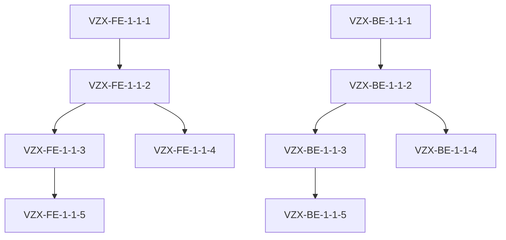

# Viewzenix Development Plan

## Overview
This document outlines the complete development plan for the Viewzenix trading webhook platform, based on the compatibility reports and current project state. The plan is organized into 5 milestones, each containing 5 phases, with each phase containing 5-10 specific tasks.

## Project Structure

### Task File Naming Convention
- Frontend Tasks: `VZX-FE-[milestone]-[phase]-[task].md`
- Backend Tasks: `VZX-BE-[milestone]-[phase]-[task].md`
- Example: `VZX-FE-1-1-1.md` (Milestone 1, Phase 1, Task 1)

### Task File Template
```markdown
## [Task ID] Task Title

**Priority:** [Critical/High/Medium/Low]
**Type:** [Feature/Enhancement/Bug/Security]
**Assignee:** [Frontend/Backend] Agent
**Status:** Todo
**Milestone:** [1-5]
**Phase:** [1-5]

### Context
[Relevant background information from compatibility reports]

### Description
[Specific task description]

### Technical Requirements
[Detailed technical specifications]

### Acceptance Criteria
[List of specific criteria]

### Dependencies
[Related tasks and external dependencies]

### Testing Requirements
[Specific testing needs]
```

## Milestones Overview

### Milestone 1: Foundation and Core Infrastructure
Focus: Setting up basic infrastructure and core services

#### Phase 1: Basic Setup and Authentication (Current Focus)
**Theme:** Core authentication and basic infrastructure setup

Tasks:
1. Setup Next.js 14 App Router structure
2. Implement basic Supabase authentication
3. Create core service layer
4. Setup basic error handling
5. Implement session management

#### Phase 2: Core API Integration
**Theme:** Basic API structure and integration

Tasks:
1. Setup API routes structure
2. Implement API middleware
3. Create base API client
4. Setup request/response handling
5. Implement basic error handling

#### Phase 3: Database and Storage
**Theme:** Data persistence and storage setup

Tasks:
1. Setup Supabase tables
2. Implement basic CRUD operations
3. Setup real-time subscriptions
4. Create data models
5. Implement data validation

#### Phase 4: Basic UI Components
**Theme:** Essential UI infrastructure

Tasks:
1. Setup component library
2. Create layout components
3. Implement form components
4. Create feedback components
5. Setup styling infrastructure

#### Phase 5: Testing Infrastructure
**Theme:** Testing setup and basic coverage

Tasks:
1. Setup testing framework
2. Create test utilities
3. Implement basic test suite
4. Setup CI/CD pipeline
5. Create testing documentation

### Milestone 2: Core Features Development
Focus: Implementing primary platform features

#### Phase 1: Webhook Management
**Theme:** Basic webhook functionality

#### Phase 2: Trading Integration
**Theme:** Basic trading operations

#### Phase 3: User Management
**Theme:** User-related features

#### Phase 4: Analytics Foundation
**Theme:** Basic analytics setup

#### Phase 5: Security Implementation
**Theme:** Core security features

### Milestone 3: Advanced Features
Focus: Enhanced functionality and optimization

### Milestone 4: Platform Enhancement
Focus: Performance and user experience improvements

### Milestone 5: Production Readiness
Focus: Final polishing and production preparation

## Current Priority: Milestone 1, Phase 1

### Task Breakdown for M1P1 (Milestone 1, Phase 1)

#### Frontend Tasks
1. VZX-FE-1-1-1: Setup Next.js 14 App Router
2. VZX-FE-1-1-2: Implement Supabase Auth UI
3. VZX-FE-1-1-3: Create Auth Service Layer
4. VZX-FE-1-1-4: Setup Error Boundaries
5. VZX-FE-1-1-5: Implement Session Management

#### Backend Tasks
1. VZX-BE-1-1-1: Setup Flask API Structure
2. VZX-BE-1-1-2: Implement Auth Middleware
3. VZX-BE-1-1-3: Create User Service
4. VZX-BE-1-1-4: Setup Error Handling
5. VZX-BE-1-1-5: Implement Session Store

### Dependencies Map


## Task Creation Guidelines

### Context Requirements
1. Include relevant sections from compatibility reports
2. Reference related architectural decisions
3. Link to relevant documentation
4. Include code examples where applicable

### Task Size Guidelines
- Each task should be completable in 2-4 hours
- Focus on single responsibility
- Clear, measurable outcomes
- Independent testing possible

### Priority Assignment
- Critical: Blocking other tasks
- High: Required for core functionality
- Medium: Important but not blocking
- Low: Nice to have

## Progress Tracking

### Task States
1. Todo
2. In Progress
3. Review
4. Done

### Milestone Completion Criteria
- All tasks in milestone completed
- Tests passing
- Documentation updated
- Security review completed
- Performance benchmarks met

## Documentation Requirements

### For Each Task
- Technical documentation
- API documentation (if applicable)
- Test documentation
- Usage examples
- Security considerations

### For Each Phase
- Phase summary
- Integration points
- Known limitations
- Future considerations

### For Each Milestone
- Milestone overview
- Achievement summary
- Lessons learned
- Next steps

## Security Considerations

### For All Tasks
- Authentication/Authorization
- Data validation
- Error handling
- Input sanitization
- Secure communications
- Audit logging

## Quality Assurance

### Testing Levels
1. Unit Testing
2. Integration Testing
3. End-to-End Testing
4. Security Testing
5. Performance Testing

### Performance Requirements
- Page load < 2s
- API response < 500ms
- Real-time updates < 100ms
- Memory usage optimization
- Network optimization

## Conclusion
This development plan provides a structured approach to completing the Viewzenix platform. It breaks down the work into manageable pieces while maintaining a clear view of the overall project goals and requirements. 