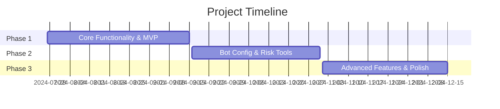

# Project Roadmap
> Last updated: 2024-05-08

## 🏆 Project Vision
To provide a reliable, feature-rich, and user-friendly platform for traders to automate their TradingView strategies with minimal setup and robust risk management.

## 🚀 Development Phases

### Phase 1: Core Functionality & MVP
**Target Completion:** 2024-09-15
**Status:** 

#### Epics
| ID | Name | Status | Description | Key Stories |
|----|------|--------|-------------|------------|
| EPIC-1.1 | Webhook Reception & Processing |  | Implement secure endpoint to receive, validate, and process TradingView alerts | [US-001](./stories/backend/US-001.md), [US-002](./stories/backend/US-002.md) |
| EPIC-1.2 | Core Order Engine |  | Integrate with Alpaca API for market order execution | [US-003](./stories/backend/US-003.md) |
| EPIC-1.3 | Initial UI Shell |  | Create React app structure with basic navigation | [US-010](./stories/frontend/US-010.md), [US-011](./stories/frontend/US-011.md) |

#### Key Deliverables
- [ ] Flask webhook endpoint with validation
- [ ] Alpaca market order integration
- [ ] Basic UI framework with navigation
- [ ] Webhook setup and broker status pages

#### Risks & Mitigations
- **Risk:** Alpaca API integration complexity
  - **Mitigation:** Early R&D spike and sandbox testing
- **Risk:** JSON schema validation edge cases
  - **Mitigation:** Comprehensive testing with sample alerts

### Phase 2: Essential Bot Configuration & Risk Tools
**Target Completion:** 2024-10-31
**Status:** 

#### Epics
| ID | Name | Status | Description | Key Stories |
|----|------|--------|-------------|------------|
| EPIC-2.1 | Bot Settings Panel |  | UI for configuring trading bot settings | [US-012](./stories/frontend/US-012.md) |
| EPIC-2.2 | Per-Order SL/TP Logic |  | Implement stop-loss and take-profit attachment | [US-004](./stories/backend/US-004.md), [US-007](./stories/backend/US-007.md) |
| EPIC-2.3 | Log Viewer |  | Interface for viewing system activity logs | [US-013](./stories/frontend/US-013.md), [US-006](./stories/backend/US-006.md) |

#### Key Deliverables
- [ ] Bot configuration API and UI
- [ ] Per-order SL/TP implementation
- [ ] Cleanup service for orphaned orders
- [ ] Log retrieval API and viewer

#### Risks & Mitigations
- **Risk:** Complex SL/TP attachment timing
  - **Mitigation:** Thorough testing with different order fill scenarios
- **Risk:** Cleanup service robustness
  - **Mitigation:** Extensive unit tests with edge cases

### Phase 3: Advanced Features & Polish
**Target Completion:** 2024-12-15
**Status:** 

#### Epics
| ID | Name | Status | Description | Key Stories |
|----|------|--------|-------------|------------|
| EPIC-3.1 | Global SL/TP Tracker |  | Portfolio-level equity circuit-breaker | [US-008](./stories/backend/US-008.md), [US-016](./stories/frontend/US-016.md) |
| EPIC-3.2 | Limit Order Support |  | Support for limit orders in trading engine | [US-009](./stories/backend/US-009.md), [US-017](./stories/frontend/US-017.md) |
| EPIC-3.3 | UI Enhancements |  | Refine UI styling and add real-time updates | [US-014](./stories/frontend/US-014.md), [US-010](./stories/backend/US-010.md) |

#### Key Deliverables
- [ ] Global SL/TP monitoring and configuration
- [ ] Limit order placement support
- [ ] WebSocket implementation for real-time updates
- [ ] UI polish and refinements

#### Risks & Mitigations
- **Risk:** Performance implications of global equity checks
  - **Mitigation:** Optimize check frequency and use asynchronous processing
- **Risk:** WebSocket complexity
  - **Mitigation:** Start with simple implementation and iterate

## 📅 Timeline Overview

## 🔄 Update Process
This roadmap should be updated when:
1. A phase is completed
2. New user stories are added
3. Priorities change
4. Timeline adjustments are needed

When updating, ensure all relevant user stories and tasks are linked, and epic status badges are current. 