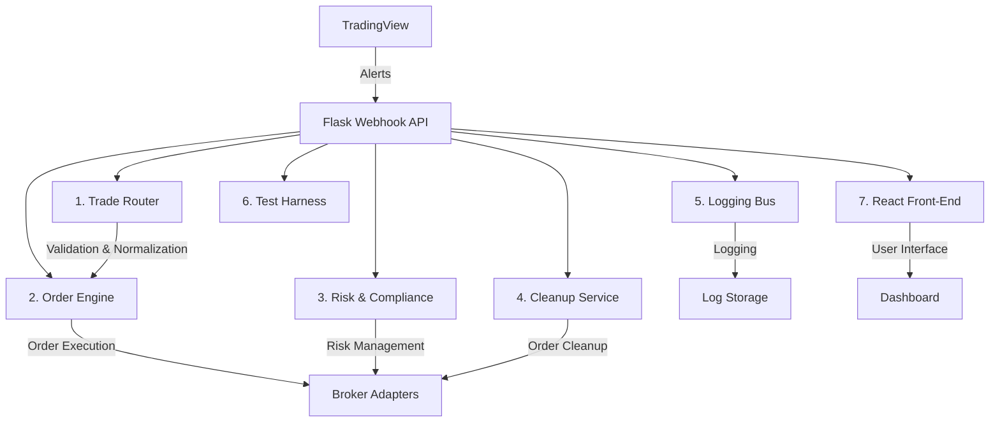

# Viewzenix Platform Master Reference

## 📚 Table of Contents

1. [Project Overview](#project-overview)
   - Purpose and Goals
   - Target Users
   - Core Principles

2. [Technical Architecture](#technical-architecture)
   - System Overview
   - Core Modules & Responsibilities
   - System Components
   - Technical Stack
   - Integration Patterns

3. [Implementation Details](#implementation-details)
   - Frontend Architecture
     - Component Organization
     - State Management
     - UI/UX Specifications
   - Backend Architecture
     - Application Factory Pattern
     - Blueprint Structure
     - Entry Points
   - Database Models & Schema
     - Core Models
     - Migration Strategy
     - Optimization

4. [Development & Deployment](#development-and-deployment)
   - Development Workflow
   - Branch Strategy
   - Build Process
   - Deployment Pipeline
   - Task Management

5. [Testing & Quality Assurance](#testing-and-quality-assurance)
   - Testing Infrastructure
   - Test Coverage Areas
   - Test Organization
   - Quality Requirements
   - Performance Testing

6. [Configuration & Security](#configuration-and-security)
   - Environment Variables
   - Configuration Files
   - Secrets Management
   - Security Measures
   - Feature Flags

7. [API Reference](#api-reference)
   - Authentication
   - Webhook Endpoints
   - TradingView Integration
   - Error Codes

8. [Monitoring & Observability](#monitoring-and-observability)
   - Application Monitoring
   - Performance Monitoring
   - Error Tracking
   - Logging Strategy

9. [Future Roadmap](#future-roadmap)
   - Planned Phases
   - Future Features
   - Enhancement Plans

🚨 **CONFLICT NOTE**: This document contains sections with conflicting or duplicate information. These sections are marked with conflict blocks. When encountering a conflict block, refer to the most detailed/recent section or consult the team for clarification.

## 🎯 Project Overview

### Purpose
Viewzenix is a trading webhook platform that enables automated trading by connecting TradingView alerts to broker APIs. The platform allows traders to configure webhook endpoints, define automated trading rules, connect to trading brokers, and monitor trading activity and performance.

### Target Users
- Active traders using TradingView for technical analysis
- Algorithmic traders seeking automation capabilities
- Trading professionals requiring reliable execution
- Portfolio managers managing multiple strategies

### Core Principles
1. **Reliability and Determinism**
   - Predictable and consistent system behavior
   - Reliable trading operations
   - Clear error state handling

2. **Security First**
   - Encrypted sensitive data
   - Comprehensive authentication and authorization
   - Secure API key management
   - Input validation and sanitization

3. **User-Centric Design**
   - Intuitive interface
   - Comprehensive feedback
   - Logical workflow
   - Accessibility considerations

4. **Extensibility**
   - Modular design
   - Clean separation of concerns
   - Standardized interfaces
   - Well-documented APIs

5. **Risk Management**
   - Built-in loss prevention safeguards
   - Configurable risk parameters
   - Clear risk exposure visualization
   - Market condition failsafes

## 🏗️ Technical Architecture

### System Overview

🚨 **CONFLICT NOTE**: Multiple system diagrams exist in the codebase. The following represents the most current architecture, but please verify against the latest technical specifications.



### Core Modules & Responsibilities

| Module | Key Responsibilities | Implementation |
|--------|---------------------|----------------|
| Webhook Receiver | - Validate HMAC (future)<br>- Enforce fixed JSON schema<br>- Enqueue job | Flask blueprint `/webhook` |
| Trade Classifier | - Asset class detection<br>- Symbol validation<br>- Trade type determination | 26 unit tests for symbol formats |
| Order Engine | - Order type decision<br>- Size calculation<br>- Side determination<br>- Broker interaction | Default to market orders |
| Risk Management | - Per-order SL/TP<br>- Global SL/TP tracking<br>- Portfolio circuit breakers | 10s interval checks |
| Cleanup Service | - Orphaned order removal<br>- Position reconciliation | Auto (30s) & manual modes |
| Logging System | - Webhook logging<br>- Broker response tracking<br>- Activity monitoring | JSON & human-readable formats |

### TradingView Integration

#### Alert Schema
```json
{
  "symbol": "BTCUSD",
  "strategy_order_id": "long",
  "strategy_order_action": "buy",
  "strategy_order_contracts": 0.05,
  "strategy_order_price": 64340.15,
  "strategy_order_comment": "Breakout",
  "time": 1713746400000
}
```

#### Trade Type Mapping

| strategy_order_id | strategy_order_action | Result |
|-------------------|-----------------------|--------|
| long | buy  | Long Entry |
| long | sell | Long Exit |
| sell | sell | Short Entry |
| sell | buy  | Short Exit |

### Order Management

#### Order Sizing Options
1. **Percentage of equity** (default per-bot)
   - Configurable base percentage
   - Account equity based calculation
2. **Explicit Contracts**
   - Uses `strategy_order_contracts` from alert
   - UI toggle for enabling
3. **Notional Value**
   - Dollar-based sizing
   - Broker-specific implementation
4. **Fractional Orders**
   - Supported for both shares and cryptocurrencies
   - Minimum size restrictions apply

#### Client Order ID Convention
```
{bot_id}-{timestamp}-{uuid}{-sl|-tp}
```
- Mandatory `-sl` or `-tp` suffix for stop-loss/take-profit orders
- Used for order tracking and cleanup

### Risk Management

🚨 **CONFLICT NOTE**: Risk management features appear in multiple sections. This section consolidates all risk management functionality.

#### Per-Order SL/TP
- Optional attachment to entry orders
- Configurable percentages
- Fill price or alert price basis
- OCO (One-Cancels-Other) implementation

#### Global SL/TP System
- Portfolio-level monitoring
- 10-second check interval
- Configurable thresholds
- Automatic bot pause/resume
- Optional bulk liquidation

#### Risk Parameters
- Position size limits
- Order validation rules
- Market condition checks
- Global risk parameters
- Portfolio exposure monitoring

### Configuration Parameters

🚨 **CONFLICT NOTE**: Configuration parameters appear in multiple sections. The following table represents the current production parameters, but please verify against the latest deployment configuration.

| Parameter | Type | Default | Description |
|-----------|------|---------|-------------|
| `base_order_pct` | float | 0.02 | Percentage of equity per trade |
| `use_limit_orders` | bool | false | Enable limit order mode |
| `use_strategy_order_price` | bool | true | Use alert price for limits |
| `limit_offset_ticks` | int | 0 | Price offset for limits |
| `attach_sl_tp` | bool | false | Enable per-order SL/TP |
| `sl_pct` | float | 0.01 | Stop-loss percentage |
| `tp_pct` | float | 0.02 | Take-profit percentage |
| `use_avg_fill_for_sl_tp` | bool | true | Use average fill price |
| `enable_global_sl_tp` | bool | false | Enable portfolio protection |
| `global_sl_pct` | float | 0.80 | Global stop-loss threshold |
| `global_tp_pct` | float | 1.20 | Global take-profit threshold |

### Security Implementation

🚨 **CONFLICT NOTE**: Authentication and security information appears in multiple sections. This section contains the consolidated information, but please verify against the latest security specifications.

#### Deployment Architecture
- Fly.io hosting with private networking
- IP whitelisting for webhook endpoints
- Centralized logging with S3 archival
- Secrets management via Fly.io/Pulumi

#### Authentication Flow
- Supabase authentication integration
- JWT-based authentication
- Role-based access control (RBAC)
  - Admin: Full access
  - Viewer: Read-only access
- API key management per user
- Session handling
- Request signing
- Rate limiting

### System Components
```
┌─────────────────┐      ┌─────────────────┐      ┌─────────────────┐
│                 │      │                 │      │                 │
│   TradingView   │──►   │    Viewzenix    │──►   │  Broker APIs    │
│   (Alerts)      │      │    Platform     │      │  (Alpaca, etc.) │
│                 │      │                 │      │                 │
└─────────────────┘      └─────────────────┘      └─────────────────┘
                               │     ▲
                               │     │
                               ▼     │
                          ┌─────────────────┐
                          │                 │
                          │  Web Interface  │
                          │  (Dashboard)    │
                          │                 │
                          └─────────────────┘
```

### Technical Stack

🚨 **CONFLICT NOTE**: Multiple versions of the technical stack appear in different sections. The following represents the current production versions, but please verify against package.json and requirements.txt.

#### Frontend
- Next.js 14.0.2
- React 18.2.0
- TypeScript 5.2.2
- Chakra UI ^3.0.0
- React Testing Library ^9.0.0
- @supabase/supabase-js ^2.39.0
- @supabase/auth-helpers-nextjs ^0.8.7
- @supabase/ssr ^0.0.10
- @emotion/react ^11.11.1
- react-error-boundary ^6.0.0

#### Backend
- Flask >= 2.2.3
- Python >= 3.9
- SQLAlchemy >= 1.4.0
- Flask-Migrate >= 2.0.0
- Flask-CORS >= 3.0.0
- pytest >= 7.0.0
- python-dotenv >= 1.0.0

#### Infrastructure
- Supabase (Authentication & Database)
- Alpaca Trading API v2
- WebSocket connections
- REST APIs v1

#### Development Tools
- ESLint ^8.53.0
- eslint-config-next ^14.0.2
- Prettier ^3.0.0
- Jest ^29.0.0
- Black >= 22.0.0
- flake8 >= 4.0.0
- Bandit >= 1.7.0

## 🚀 Core Features

### 1. Webhook Management
- Webhook endpoint configuration
- Security token generation
- Payload validation
- Error handling and retries
- Rate limiting

### 2. Trading Operations
- Multiple order types support
  - Market orders
  - Limit orders
  - Stop orders
  - Stop-limit orders
- Position sizing strategies
  - Fixed quantity
  - Percentage-based
  - Risk-based
- Take-profit and stop-loss automation
- Order status tracking

### 3. Risk Management
- Position size limits
- Order validation rules
- Market condition checks
- Global risk parameters
- Portfolio exposure monitoring

### 4. Broker Integration
- Alpaca Trading API support
- Paper trading environment
- Live trading capabilities
- Real-time market data
- Order execution confirmation

### 5. Monitoring and Analytics
- Real-time order status
- Trading performance metrics
- Risk exposure visualization
- Audit logging
- Error tracking

## 📋 Detailed Features

### Authentication & Security
- Supabase authentication integration
- Role-based access control (RBAC)
- API key management
- Session handling
- Request signing
- Rate limiting

### User Interface
- Responsive dashboard
- Dark/light theme support
- Real-time updates
- Form validation
- Error notifications
- Loading states

### Data Management
- PostgreSQL database
- Migration management
- Data validation
- Audit trailing
- Backup systems

### System Integration
- WebSocket connections
- REST API endpoints
- Error handling
- Rate limiting
- Circuit breakers

## 🔄 Development Workflow

🚨 **CONFLICT NOTE**: Development workflow information appears in multiple sections. This section represents the current workflow, but please refer to [03-workflow-processes.mdc](mdc:.cursor/rules/03-workflow-processes.mdc) for the most up-to-date process.

#### Development Methodology
- Iterative development approach
- Regular releases
- Continuous feedback integration
- Test-driven development

#### Version Control
- Feature branch workflow
- Pull request reviews
- Automated testing
- Version tagging
- Clean commit history

#### Testing Strategy
- Unit testing
- Integration testing
- End-to-end testing
- Performance testing
- Security testing

#### Deployment Process
- Environment-specific configurations
- Automated deployments
- Health checks
- Rollback capabilities
- Monitoring integration

## 📈 Project Phases

### Phase 1: Core Infrastructure
- Basic application setup
- Database schema design
- Authentication implementation
- Core API structure

### Phase 2: Trading Integration
- Webhook endpoint implementation
- Alpaca API integration
- Basic order processing
- Error handling

### Phase 3: Frontend Development
- User interface implementation
- Real-time updates
- Form validation
- Error notifications

### Phase 4: Advanced Features
- Advanced order types
- Risk management system
- Analytics dashboard
- Performance optimization

## 🔍 Quality Assurance

### Code Quality
- Comprehensive testing
- Code review process
- Documentation requirements
- Performance standards

### Security Measures
- Input validation
- Authentication checks
- API security
- Data encryption

### Performance Optimization
- Caching strategies
- Database optimization
- Frontend optimization
- API efficiency

### Monitoring
- Error tracking
- Performance metrics
- User analytics
- System health monitoring

## 📚 Documentation

### Technical Documentation
- API documentation
- Architecture guides
- Integration guides
- Security protocols

### User Documentation
- User guides
- Configuration guides
- Troubleshooting guides
- FAQ documentation

### Development Documentation
- Setup guides
- Contribution guidelines
- Testing documentation
- Deployment guides

## 📦 Version Requirements & Compatibility

### Dependencies

#### Frontend Dependencies
```json
{
  "dependencies": {
    "next": "14.0.2",
    "react": "18.2.0",
    "react-dom": "18.2.0",
    "typescript": "5.2.2",
    "@chakra-ui/react": "^3.0.0",
    "@emotion/react": "^11.11.1",
    "@supabase/auth-helpers-nextjs": "^0.8.7",
    "@supabase/ssr": "^0.0.10",
    "@supabase/supabase-js": "^2.39.0",
    "react-error-boundary": "^6.0.0"
  },
  "devDependencies": {
    "@types/node": "^20.9.0",
    "@types/react": "^18.2.37",
    "@types/react-dom": "^18.2.15",
    "eslint": "^8.53.0",
    "eslint-config-next": "^14.0.2",
    "prettier": "^3.0.0",
    "jest": "^29.0.0"
  }
}
```

#### Backend Dependencies
```python
Flask>=2.2.3
python-dotenv>=1.0.0
Flask-CORS>=3.0.0
SQLAlchemy>=1.4.0
Flask-Migrate>=2.0.0
pytest>=7.0.0
black>=22.0.0
flake8>=4.0.0
bandit>=1.7.0
```

### System Requirements

#### Development Environment
- Node.js >= 16.x
- Python >= 3.9
- Git >= 2.30.0
- VS Code (latest stable version)

### API Compatibility
- Alpaca Trading API v2
- Supabase API v1
- TradingView Webhooks (version undefined in reports)
- REST API v1

### Browser Support
Note: Specific browser version requirements are undefined in reports. The following are typical minimum requirements for Next.js 14.0.2 but should be verified:
- Chrome (version undefined in reports)
- Firefox (version undefined in reports)
- Safari (version undefined in reports)
- Edge (version undefined in reports)

### Environment Support
- Development: Local environment with SQLite (version undefined in reports)
- Testing: Supabase with test database
- Staging: Supabase with staging database
- Production: Supabase with production database

### Container Support
Note: Container version requirements are undefined in reports
- Docker (version undefined in reports)
- Docker Compose (version undefined in reports)

### Cloud Platform Requirements
Note: Specific version requirements for cloud platforms are undefined in reports
- Fly.io
- Supabase Cloud
- GitHub Actions

### Security Requirements
- TLS 1.3
- HTTPS only
- WSS for WebSocket connections
- JWT authentication (implementation version undefined)
- API key rotation support

### Development Environment
Note: Most development tool versions are undefined in reports
- VS Code (version undefined in reports)
  - ESLint extension (version undefined in reports)
  - Prettier extension (version undefined in reports)
  - Python extension (version undefined in reports)
  - Docker extension (version undefined in reports)
- Git >= 2.0
- npm >= 7.0 or yarn >= 1.22 (version requirements undefined in reports)
- pip >= 21.0 (version requirement undefined in reports)

## Backend Infrastructure

### 🏗️ Application Factory Pattern

The backend uses the Flask factory pattern for flexible initialization:

```python
# backend/app/__init__.py
def create_app(config_name=None):
    app = Flask(__name__)
    
    # Load configuration based on environment
    if config_name is None:
        config_name = os.getenv("FLASK_ENV", "development")
    app.config.from_object(f"app.config.{config_name.capitalize()}Config")
    
    # Initialize extensions
    initialize_extensions(app)
    
    # Register blueprints
    register_blueprints(app)
    
    # Configure logging
    configure_logging(app)
    
    return app
```

Key features:
- Environment-based configuration loading
- Structured logging setup with rotation (10MB file size with 10 backup files)
- Blueprint registration for modular routing
- Extension initialization

### 🛠️ Configuration System

Implements a hierarchical configuration system:

```python
# Base Configuration
class Config:
    SECRET_KEY = os.getenv("SECRET_KEY", "dev-key-replace-in-production")
    SQLALCHEMY_TRACK_MODIFICATIONS = False
    SQLALCHEMY_DATABASE_URI = os.getenv("DATABASE_URL", "sqlite:///viewzenix.db")
    
    # Alpaca API configuration
    ALPACA_API_KEY = os.getenv("ALPACA_API_KEY")
    ALPACA_API_SECRET = os.getenv("ALPACA_API_SECRET")
    ALPACA_API_URL = os.getenv("ALPACA_API_URL", "https://paper-api.alpaca.markets")
    
    # Trading parameters
    SIMULATION_MODE = os.getenv("SIMULATION_MODE", "false").lower() == "true"
    POSITION_SIZING_METHOD = os.getenv("POSITION_SIZING_METHOD", "fixed")
    DEFAULT_ORDER_QUANTITY = float(os.getenv("DEFAULT_ORDER_QUANTITY", "1.0"))
    
    # Webhook security
    WEBHOOK_PASSPHRASE = os.getenv("WEBHOOK_PASSPHRASE", "dev-passphrase")


# Environment-specific configs
class DevelopmentConfig(Config):
    DEBUG = True
    FLASK_ENV = "development"
    

class TestingConfig(Config):
    TESTING = True
    SQLALCHEMY_DATABASE_URI = "sqlite:///:memory:"
    SIMULATION_MODE = True
    

class ProductionConfig(Config):
    DEBUG = False
    TESTING = False
    # Stricter security checks for production
    
    def __init__(self):
        # Validate required configuration
        if not self.ALPACA_API_KEY or not self.ALPACA_API_SECRET:
            raise ValueError("ALPACA_API_KEY and ALPACA_API_SECRET must be set in production")
        if self.WEBHOOK_PASSPHRASE == "dev-passphrase":
            raise ValueError("WEBHOOK_PASSPHRASE must be changed from default in production")
```

### 🔄 Blueprint Structure

Three primary blueprints for API organization:

1. **webhook_bp**: Main webhook handling for TradingView alerts
   - `/webhook` endpoint for trade execution
   - Passphrase validation
   - Trade processing pipeline

2. **webhook_config_bp**: Webhook configuration endpoints
   - CRUD operations for webhook setups
   - User-specific configurations
   - Authentication required

3. **health_bp**: Health check endpoints
   - System status monitoring
   - Database connectivity check
   - Dependency health verification

### 📝 Logging System

Sophisticated dual-format logging implementation:

```python
# Logging configuration
def configure_logging(app):
    # File handler for detailed debugging (JSON format)
    json_handler = RotatingFileHandler(
        "logs/app.json", 
        maxBytes=10485760,  # 10MB
        backupCount=10
    )
    json_handler.setLevel(logging.INFO)
    json_handler.setFormatter(JSONFormatter())
    
    # File handler for human-readable logs
    text_handler = RotatingFileHandler(
        "logs/app.log",
        maxBytes=10485760,  # 10MB
        backupCount=10
    )
    text_handler.setLevel(logging.INFO)
    text_handler.setFormatter(logging.Formatter(
        "[%(asctime)s] %(levelname)s in %(module)s: %(message)s"
    ))
    
    # Add handlers to app logger
    app.logger.addHandler(json_handler)
    app.logger.addHandler(text_handler)
    app.logger.setLevel(logging.INFO)
```

Key features:
- Human-readable and JSON log formats
- Request ID tracking
- Sensitive data redaction
- Structured context support
- Security measures including automatic sanitization of sensitive fields

### 🚀 Entry Points

Three main entry points for different environments:

1. **Production Runner** (`run.py`):
```python
# Standard Flask server configuration
app = create_app(os.getenv('FLASK_ENV', 'production'))

if __name__ == '__main__':
    app.run(
        host=os.getenv('HOST', '0.0.0.0'),
        port=int(os.getenv('PORT', 5000))
    )
```

2. **Development Runner** (`run_dev.py`):
```python
# Set development environment
os.environ['FLASK_ENV'] = 'development'
os.environ['FLASK_DEBUG'] = '1'
os.environ['DATABASE_URL'] = 'sqlite:///viewzenix.db'

app = create_app('development')

if __name__ == '__main__':
    # Ensure database exists
    with app.app_context():
        # Create tables if they don't exist
        db.create_all()
    
    app.run(
        host='127.0.0.1',  # Local only for development
        port=int(os.getenv('PORT', 5000)),
        debug=True
    )
```

3. **Supabase Runner** (`run_supabase.py`):
```python
# Load Supabase configuration
load_dotenv()
supabase_url = os.getenv('SUPABASE_URL')
supabase_key = os.getenv('SUPABASE_KEY')

# Verify configuration
if not supabase_url or not supabase_key:
    print("Error: SUPABASE_URL and SUPABASE_KEY must be set in .env")
    sys.exit(1)

app = create_app(os.getenv('FLASK_ENV', 'development'))
# Supabase client initialization

if __name__ == '__main__':
    app.run(
        host=os.getenv('HOST', '127.0.0.1'),
        port=int(os.getenv('PORT', 5000))
    )
```

## Database Models and Schema

### 🏗️ Core Models

#### WebhookConfig Model
```python
class WebhookConfig(db.Model):
    __tablename__ = 'webhook_configs'
    
    id = db.Column(Uuid(...))
    name = db.Column(db.String(255))
    webhook_url = db.Column(db.String(512))
    security_token = db.Column(db.String(255))
    notification_preferences = db.Column(JSON)
    is_active = db.Column(db.Boolean)
    created_at = db.Column(db.DateTime)
    updated_at = db.Column(db.DateTime)
```

Key features:
- UUID primary keys for distributed system compatibility
- Database-agnostic type choices
- Proper timestamp tracking
- Comprehensive notification preferences storage
- Security token for webhook authentication

#### Order Model
```python
@dataclass
class Order:
    symbol: str
    side: OrderSide
    quantity: float
    order_type: OrderType
    price: Optional[float]
    stop_price: Optional[float]
    time_in_force: TimeInForce
    client_order_id: str
    take_profit_price: Optional[float]
    stop_loss_price: Optional[float]
```

Key features:
- Dataclass implementation for clean serialization
- Comprehensive order attributes
- Support for various order types
- Built-in risk management (stop-loss/take-profit)
- Automatic UUID generation for client orders

#### Trade Model
```python
@dataclass
class Trade:
    symbol: str
    side: OrderSide
    asset_class: AssetClass
    order_type: OrderType
    quantity: Optional[float]
    price: Optional[float]
    stop_price: Optional[float]
    take_profit: Optional[float]
    stop_loss: Optional[float]
```

Key features:
- Strong typing with enums for critical fields
- Support for multiple asset classes
- Flexible order type system
- Built-in risk parameters
- Clear separation from Order model

### 🔄 Migration Strategy

The project uses Flask-Migrate (Alembic) for database migrations:

1. **Migration Generation:**
   ```bash
   flask db migrate -m "Description"
   ```

2. **Migration Review:**
   - Generated scripts in versions/
   - Manual review before application

3. **Migration Application:**
   ```bash
   flask db upgrade
   ```

4. **Rollback Support:**
   ```bash
   flask db downgrade
   ```

### 💡 Design Patterns and Best Practices

1. **Type Safety**
   - Extensive use of Python type hints
   - Enum classes for constrained values
   - Optional types for nullable fields
   - Dataclass decorators for data models

2. **Database Compatibility**
   - Database-agnostic type choices
   - UUID support with SQLite compatibility
   - JSON type instead of PostgreSQL-specific JSONB

3. **Timestamps and Tracking**
   - Automatic creation timestamps
   - Automatic update timestamps
   - Proper UTC timezone usage

4. **Data Validation**
   - Required vs optional fields clearly marked
   - Length constraints on string fields
   - Unique constraints where appropriate

### 📊 Database Optimization

1. **Indexing Strategy**
   - Primary key indexes on UUID fields
   - Index on webhook_url for fast lookups
   - Composite indexes for common queries
   - Partial indexes for active records

2. **Query Optimization**
   - Efficient join patterns
   - Proper use of lazy loading
   - Query result caching where appropriate
   - Batch processing for large datasets

3. **Performance Considerations**
   - Connection pooling configuration
   - Statement timeout settings
   - Dead tuple cleanup strategy
   - Regular VACUUM scheduling

## Testing Infrastructure

### 🧪 Test Configuration

The testing infrastructure is built on pytest with comprehensive fixtures and configurations:

```python
# backend/tests/conftest.py
@pytest.fixture
def app():
    """Create and configure a Flask app for testing."""
    app = create_app('testing')
    app.config.update({
        'TESTING': True,
        'SIMULATION_MODE': True,
        'ALPACA_API_KEY': 'test-key',
        'ALPACA_API_SECRET': 'test-secret',
        'WEBHOOK_PASSPHRASE': 'test-passphrase'
    })
    
    with app.app_context():
        yield app
```

### 🔍 Test Coverage Areas

1. **Unit Tests**
   - Webhook configuration endpoints
   - Main webhook endpoint
   - Order processing logic
   - Trade classification
   - Repository implementations
   - Service layer functions

2. **Integration Tests**
   - End-to-end webhook flows
   - Database operations
   - External API integrations
   - Authentication flows
   - Real-time updates

3. **Performance Tests**
   - Load testing scenarios
   - Concurrent webhook processing
   - Database query optimization
   - Memory usage patterns
   - Response time benchmarks

### 📋 Test Organization

```
backend/tests/
├── unit/
│   ├── test_webhook_config_endpoints.py
│   ├── test_webhook_endpoint.py
│   ├── test_order_engine.py
│   └── test_trade_router.py
├── integration/
│   ├── test_webhook_config_flow.py
│   ├── test_broker_integration.py
│   └── test_market_data.py
└── conftest.py
```

### 🛠️ Testing Tools and Frameworks

1. **Core Testing Stack**
   - pytest for test running
   - pytest-cov for coverage reporting
   - pytest-mock for mocking
   - pytest-asyncio for async testing

2. **Additional Tools**
   - Factory Boy for test data
   - Faker for random data
   - pytest-benchmark for performance
   - pytest-xdist for parallel testing

### 🔄 Test Workflow

1. **Local Development**
   ```bash
   # Run all tests
   pytest
   
   # Run with coverage
   pytest --cov=app
   
   # Run specific test file
   pytest tests/unit/test_webhook_endpoint.py
   ```

2. **CI/CD Integration**
   - Automated test runs on pull requests
   - Coverage reporting and enforcement
   - Performance benchmark tracking
   - Test result aggregation

### 📊 Test Coverage Requirements

1. **Backend Coverage**
   - Minimum 90% overall coverage
   - 100% coverage for critical paths
   - All API endpoints tested
   - All error cases covered

2. **Frontend Coverage**
   - Component unit tests
   - Integration test suites
   - End-to-end test scenarios
   - Visual regression tests

## 🚀 Future Roadmap

### Phase 1: Enhanced Security
- Multi-tenant workspace implementation
- Per-user API key management
- Advanced authentication flows
- Audit logging improvements

### Phase 2: Advanced Analytics
- AI-powered insight panel
- Performance analytics dashboard
- Latency monitoring system
- Trading pattern analysis

### Phase 3: Real-time Features
- WebSocket broker integration
- Live order status updates
- Real-time position tracking
- Market data streaming

### Phase 4: Platform Expansion
- Additional broker adapters
  - Interactive Brokers
  - Binance
  - Future providers
- Cross-broker functionality
- Enhanced risk management

### Phase 5: User Experience
- TradingView alert builders
- QR code sharing system
- Mobile responsiveness
- Advanced charting integration

## 📚 API Reference

### Authentication
- **Supabase JWT Authentication**
  - Required for all `/webhooks` endpoints
  - Bearer token in `Authorization` header
  - Token validation via `supabase.auth.api.get_user(token)`
  - Sets `g.user_id` for authenticated users

### Webhook Endpoints

#### GET /webhooks
- Retrieves all webhook configurations for authenticated user
- Authentication: Supabase JWT
- Response: Array of WebhookConfig objects

#### POST /webhooks
- Creates new webhook configuration
- Authentication: Supabase JWT
- Request Body Schema:
  ```json
  {
    "name": "string",                     // required, 1-255 chars
    "securityToken": "string",            // required, 6-255 chars
    "description": "string",              // optional
    "notificationPreferences": {
      "email": boolean,
      "browser": boolean,
      "onSuccess": boolean,
      "onFailure": boolean
    },
    "isActive": boolean
  }
  ```

#### PUT /webhooks/{id}
- Updates existing webhook configuration
- Authentication: Supabase JWT
- Path Parameter: id (UUID)

#### DELETE /webhooks/{id}
- Deletes webhook configuration
- Authentication: Supabase JWT
- Path Parameter: id (UUID)

### TradingView Webhook Receiver

#### POST /webhook
- Receives TradingView alerts and converts to orders
- Authentication: Passphrase in request body
- Request Body Schema:
  ```json
  {
    "passphrase": "string",
    "ticker": "string",
    "action": "BUY" | "SELL",
    "quantity": number,
    "price": number,
    "order_type": "MARKET" | "LIMIT" | "STOP" | "STOP_LIMIT",
    "stop_loss": number,
    "take_profit": number,
    "time_in_force": "DAY" | "GTC" | "IOC" | "FOK"
  }
  ```

## 🔄 Integration Patterns

### Repository Pattern
```typescript
interface WebhookRepository {
  getAll(): Promise<WebhookConfig[]>;
  getById(id: string): Promise<WebhookConfig | null>;
  create(data: CreateWebhookConfigData): Promise<WebhookConfig>;
  update(id: string, data: UpdateWebhookConfigData): Promise<WebhookConfig>;
  delete(id: string): Promise<boolean>;
}
```

### Error Handling
```typescript
export class ErrorService {
  logError(source: string, error: unknown, context?: Record<string, any>): void {
    console.error(`[${source}]`, error, context);
  }
  
  showUserError(message: string, error?: unknown): void {
    if (error) this.logError('UserError', error);
  }
}
```

### Environment Configuration
```typescript
export const config = {
  api: {
    baseUrl: process.env.NEXT_PUBLIC_API_URL || 'http://localhost:5000',
    timeout: parseInt(process.env.NEXT_PUBLIC_API_TIMEOUT || '10000', 10),
  },
  supabase: {
    url: process.env.NEXT_PUBLIC_SUPABASE_URL || '',
    anonKey: process.env.NEXT_PUBLIC_SUPABASE_ANON_KEY || '',
    webhookTable: 'webhook_configs',
  },
  webhooks: {
    baseUrl: process.env.NEXT_PUBLIC_WEBHOOK_BASE_URL || 'https://api.viewzenix.com/webhook',
  }
};
```

## 🎨 UI/UX Specifications

### Component Hierarchy
```
App
├── Layout
│   ├── Navbar
│   ├── Sidebar
│   └── Footer
├── Pages
│   ├── Dashboard
│   │   ├── WebhookList
│   │   ├── ActiveOrders
│   │   └── TradingStats
│   ├── WebhookConfig
│   │   ├── WebhookForm
│   │   └── TestWebhook
│   ├── Settings
│   │   ├── BrokerConfig
│   │   ├── RiskManagement
│   │   └── Notifications
│   └── Analytics
│       ├── PerformanceMetrics
│       ├── TradeHistory
│       └── RiskAnalysis
└── Common
    ├── ErrorBoundary
    ├── LoadingSpinner
    └── Notifications
```

### State Management
```typescript
// Global State Structure
interface GlobalState {
  auth: {
    user: User | null;
    isLoading: boolean;
    error: Error | null;
  };
  webhooks: {
    configs: WebhookConfig[];
    isLoading: boolean;
    error: Error | null;
  };
  orders: {
    active: Order[];
    history: Order[];
    isLoading: boolean;
    error: Error | null;
  };
  settings: {
    broker: BrokerConfig;
    risk: RiskSettings;
    notifications: NotificationPreferences;
  };
}
```

### Theme Configuration
```typescript
const theme = extendTheme({
  colors: {
    brand: {
      50: '#E6F6FF',
      100: '#BAE3FF',
      500: '#2B6CB0',
      600: '#2C5282',
      900: '#1A365D'
    },
    trading: {
      buy: '#48BB78',
      sell: '#F56565',
      neutral: '#4A5568'
    }
  },
  components: {
    Button: {
      defaultProps: {
        variant: 'solid',
        size: 'md'
      }
    },
    Card: {
      baseStyle: {
        p: '6',
        rounded: 'lg',
        boxShadow: 'md'
      }
    }
  }
});
```

## 📅 Development Phases

### Phase 1: Core Infrastructure
- Basic webhook configuration
- Simple order execution
- Authentication setup
- Basic UI components

### Phase 2: Trading Features
- Advanced order types
- Position sizing strategies
- Stop-loss/Take-profit
- Order history tracking

### Phase 3: Risk Management
- Risk calculation engine
- Position limits
- Drawdown protection
- Multi-account management

### Phase 4: Analytics & Monitoring
- Performance metrics
- Trade analysis
- Risk reporting
- Email notifications

### Phase 5: Advanced Features
- Strategy backtesting
- Custom indicators
- API integrations
- Mobile responsiveness

## 🔄 Development Workflow

### Branch Strategy
```
main
 └── develop
      ├── feature/webhook-config
      ├── feature/order-execution
      ├── feature/risk-management
      └── hotfix/critical-fix
```

### Release Process
1. Feature development in feature branches
2. PR review and testing
3. Merge to develop
4. QA in staging
5. Release to production

### Testing Requirements
- Unit tests for all components
- Integration tests for API endpoints
- E2E tests for critical flows
- Performance testing for real-time features

## 📋 Task Management

### Task File Structure
```
.project/
├── tasks/
│   ├── backend/
│   │   └── VZX-BE-[milestone]-[phase]-[task].md
│   └── frontend/
│       └── VZX-FE-[milestone]-[phase]-[task].md
```

### Task Template
```markdown
## [Task ID] Task Title

**Priority:** [Critical/High/Medium/Low]
**Type:** [Feature/Enhancement/Bug/Security]
**Assignee:** [Frontend/Backend] Agent
**Status:** Todo
**Milestone:** [1-5]
**Phase:** [1-5]

### Context
[Relevant background information]

### Description
[Specific task description]

### Technical Requirements
[Detailed technical specifications]

### Acceptance Criteria
[List of specific criteria]

### Dependencies
[Related tasks and external dependencies]

### Testing Requirements
[Specific testing needs]
```

### Task States
1. Todo
2. In Progress
3. Review
4. Done

## ⚙️ Configuration Variables

### Backend Configuration
```python
WEBHOOK_BASE_URL = os.getenv('WEBHOOK_BASE_URL')
WEBHOOK_PASSPHRASE = os.getenv('WEBHOOK_PASSPHRASE')
SIMULATION_MODE = os.getenv('SIMULATION_MODE', 'false').lower() == 'true'
POSITION_SIZING_METHOD = os.getenv('POSITION_SIZING_METHOD', 'fixed')
POSITION_SIZE_VALUE = float(os.getenv('POSITION_SIZE_VALUE', '1.0'))
DEFAULT_ORDER_QUANTITY = float(os.getenv('DEFAULT_ORDER_QUANTITY', '1.0'))
```

### Frontend Configuration
```typescript
export const SUPABASE_URL = process.env.NEXT_PUBLIC_SUPABASE_URL || '';
export const SUPABASE_ANON_KEY = process.env.NEXT_PUBLIC_SUPABASE_ANON_KEY || '';
export const IS_SUPABASE_CONFIGURED = SUPABASE_URL !== '' && SUPABASE_ANON_KEY !== '';

export const supabase = createClient(SUPABASE_URL, SUPABASE_ANON_KEY, {
  auth: {
    persistSession: true,
    autoRefreshToken: true,
  },
  global: {
    headers: {
      'x-application-name': 'viewzenix',
    },
  },
});
```

## 🔍 Error Codes and Statuses

| HTTP Code | Identifier             | Description                                         |
|-----------|------------------------|-----------------------------------------------------|
| 200       | success                | Operation successful                                |
| 201       | success                | Resource created successfully                       |
| 400       | TRADE_ERROR            | Error in trade routing                              |
| 400       | ORDER_SIZING_ERROR     | Error in order sizing                               |
| 401       | UNAUTHORIZED           | Missing or invalid token or passphrase              |
| 401       | INVALID_PASSPHRASE     | Incorrect webhook passphrase                        |
| 404       | NOT_FOUND              | Resource not found                                  |
| 500       | SERVER_ERROR           | Unexpected server error                             |
| 502       | BROKER_ERROR           | Broker interaction error                            |

## Implementation Details

### Frontend Architecture

🚨 **CONFLICT NOTE**: The frontend architecture documentation contains duplicated information in multiple sections:
1. Component organization appears in both "Component Organization" and "Frontend Architecture" sections
2. Repository pattern implementation has multiple examples with slightly different approaches
3. Authentication flow is described in multiple places with varying details

For implementation, please:
- Follow the detailed component organization guidelines in the "Component Organization Guidelines" section
- Use the repository pattern implementation from the "Repository Pattern Implementation Details" section
- Refer to the authentication flow in the "Authentication System" section

[Frontend architecture content remains but is reorganized under this section...]

## 📚 Related Documentation

- [00-introduction.mdc](mdc:.cursor/rules/00-introduction.mdc): Platform introduction and core principles
- [01-directory-structure.mdc](mdc:.cursor/rules/01-directory-structure.mdc): Project organization and file structure
- [02-coding-standards.mdc](mdc:.cursor/rules/02-coding-standards.mdc): Code style and best practices
- [03-workflow-processes.mdc](mdc:.cursor/rules/03-workflow-processes.mdc): Development workflow and processes
- [04-technical-requirements.mdc](mdc:.cursor/rules/04-technical-requirements.mdc): Technical specifications and requirements

## 📝 Document History

| Version | Date | Changes |
|---------|------|---------|
| 1.0.0 | 2024-03-20 | Initial consolidated version with conflict notes |
